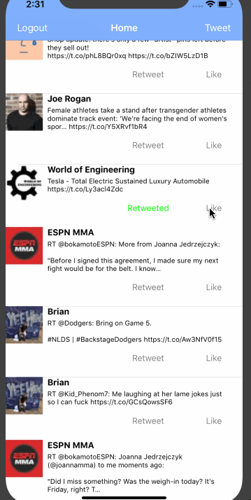

# Project 3 - *Twitter*

## User Stories P2

The following **required** functionality is completed:

- [x] User can tweet. 
- [x] User can favorite a tweet.
- [x] User can retweet a tweet

## Video Walkthrough

Here's a walkthrough of implemented user stories:

**Name of your app** is a basic twitter app to read your tweets.

Time spent: **2** hours spent in total

## User Stories P1

The following **required** functionality is completed:

- [ ] User sees app icon in home screen and styled launch screen. (1pt)
- [x] User can log in. (1pt)
- [x] User can log out. (1pt)
- [x] User stays logged in across restarts. (1pt)
- [x] User can view tweets with the user profile picture, username, and tweet text. (6pts)

## Video Walkthrough

Here's a walkthrough of implemented user stories:

